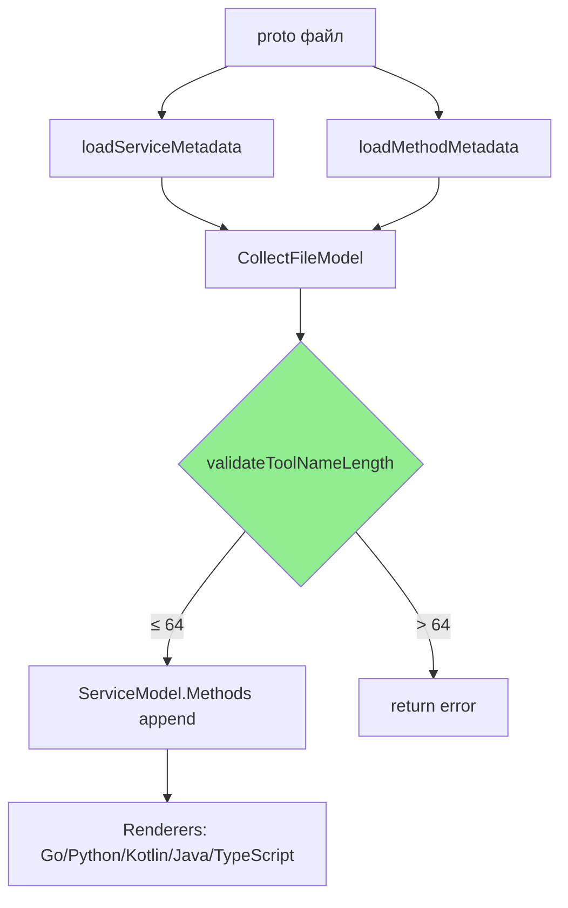

# Phase 0: Tool Name Length Validation — Design

**Status:** Draft
**Author:** AI Agent
**Date:** 2026-06-09

## Обзор

Добавить fail-fast валидацию длины MCP tool name в collector (`collect.go`). Если `namespace + "_" + methodName` после нормализации превышает 64 символа, генерация завершается с ошибкой. Проверка работает до вызова language-specific рендерера, поэтому покрывает все 5 языков.

## Архитектура



**Порядок реализации:** единственная точка изменения — `collect.go`.

## Компоненты и интерфейсы

### Файлы, требующие изменений

| Файл | Тип изменения | Описание |
|------|---------------|----------|
| `internal/codegen/collect.go` | `[MODIFIED]` | Добавляет вызов `validateToolNameLength(namespace, methodName)` после формирования `methodModel` (строка 95), перед `append` (строка 100) |
| `internal/codegen/collect_test.go` | `[MODIFIED]` | Добавляет тесты `TestCollectFileModel_RejectsToolNameExceeding64Chars` и `TestCollectFileModel_AcceptsToolNameWithin64Chars` |

### Файлы, НЕ требующие изменений

| Файл | Причина |
|------|---------|
| `mcpruntime/options.go` | Runtime `qualifyToolName()` остаётся без изменений — проверка на этапе генерации |
| `internal/codegen/metadata.go` | Metadata loading не меняется — валидация после сбора metadata |
| `internal/codegen/render_*.go` | Все 5 рендереров не меняются — валидация до рендеринга |
| `internal/codegen/model.go` | IR модель не меняется — никаких новых полей |

### Интерфейс

```go
// validateToolNameLength проверяет что финальное MCP tool name
// не превышает maxToolNameLength (64) символов.
// namespace и methodName нормализуются (dots → underscores) перед проверкой.
func validateToolNameLength(namespace, methodName string) error
```

- **Вход:** `namespace` (из `serviceMetadata.Namespace`), `methodName` (из `methodMetadata.Name`)
- **Выход:** `nil` если длина ≤ 64, иначе `error` с полным именем, длиной и лимитом
- **Предусловие:** оба аргумента уже trimmed (обеспечивается `loadServiceMetadata` / `loadMethodMetadata`)

## Ключевые решения

**Decision: Валидация в collector, а не в renderer**
- **Context:** Проверку длины можно добавить в каждый из 5 рендереров или один раз в collector.
- **Options:** (A) По одной проверке в каждом рендерере. (B) Одна проверка в collector.
- **Decision:** Вариант B — collector.
- **Rationale:** DRY; tool name формируется из proto metadata, одинакового для всех языков. Collector уже делает fail-fast проверки (proto3 syntax, streaming RPC).
- **Consequences:** Если рендерер когда-либо изменит имя — нужен дополнительный guard. Сейчас рендереры не модифицируют имена.

## Свойства корректности

**Property 1: Пропускание коротких имён**
Category: Absence
Statement: For all namespace и methodName где `len(normalize(namespace) + "_" + normalize(methodName)) ≤ 64`, ошибка валидации длины никогда не возникает.
Validates: Requirements 1.1, 1.3

**Property 2: Отклонение длинных имён**
Category: Propagation
Statement: For all namespace и methodName где `len(normalize(namespace) + "_" + normalize(methodName)) > 64`, `CollectFileModel` возвращает ошибку, содержащую полное имя, текущую длину и лимит 64.
Validates: Requirements 1.2, 1.6

**Property 3: Нормализация перед проверкой**
Category: Equivalence
Statement: For all имён, содержащих `.` (dot), финальная длина проверяется после замены `.` на `_`, и результат идентичен `normalizeToolSegment` из `mcpruntime/options.go`.
Validates: Requirements 1.4

**Property 4: Единообразие для всех языков**
Category: Absence
Statement: For all `Options.Language` ∈ {go, python, kotlin, java, typescript}, ни один рендерер не вызывается если `validateToolNameLength` вернул ошибку.
Validates: Requirements 1.5

## Обработка ошибок

| Сценарий | Обнаружение | Действие |
|----------|-------------|----------|
| Tool name > 64 символов | `validateToolNameLength` в `CollectFileModel` | Возврат `fmt.Errorf` с полным именем, длиной и лимитом; генерация прерывается |
| Пустой namespace + methodName ≤ 64 | `len(methodName) ≤ 64` | Нет ошибки — имя без prefix |

## Тестирование

**Test Style Source:** Tier 2
- Evidence: [collect_test.go](file:///Users/zergslaw/Documents/Projects/easyp-tech/protoc-gen-mcp/internal/codegen/collect_test.go) — table-driven subtests, `compiledTestFiles()` helper, assertion через `t.Fatalf`
- Key patterns: `TestCollectFileModel_*`, in-process descriptor compilation через `protocompile`

**Project Commands:**

| Действие | Команда |
|----------|---------|
| Test | `go test ./internal/codegen/... -count=1` |
| Build | `go build ./cmd/protoc-gen-mcp` |
| Lint | `easyp lint` |

### Unit Tests

| Test | Описание | Tags |
|------|----------|------|
| `TestCollectFileModel_AcceptsToolNameWithin64Chars` | namespace + methodName ≤ 64 → CollectFileModel возвращает nil error | `Feature/tool-name-length` |
| `TestCollectFileModel_RejectsToolNameExceeding64Chars` | namespace + methodName > 64 → CollectFileModel возвращает error с полным именем и лимитом | `Feature/tool-name-length` |
| `TestCollectFileModel_ToolNameLengthChecksAfterDotNormalization` | namespace с `.` нормализуется в `_` перед проверкой длины | `Feature/tool-name-length` |

### Property-Based Tests

PBT unavailable — используются targeted unit tests.

| Test | Property | Generator | Tags |
|------|----------|-----------|------|
| `TestValidateToolNameLength_ShortNamesPass` | Property 1 | Ручные кейсы: пустой namespace, 64 ровно, 63 | `Property/1` |
| `TestValidateToolNameLength_LongNamesFail` | Property 2 | Ручные кейсы: 65, 100, длинный namespace | `Property/2` |
| `TestValidateToolNameLength_DotNormalization` | Property 3 | Ручные кейсы: `my.company` namespace | `Property/3` |
