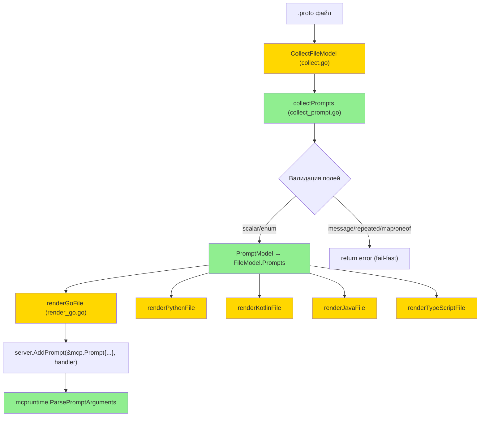

# MCP Prompts — Design

**Status:** Draft
**Author:** AI Agent
**Date:** 2026-06-10

## Обзор

Реализация MCP Prompts разбивается на 4 логических компонента:

1. **Proto контракт** — расширение `PromptOptions` (91008) в `options.proto`
2. **Collector + IR модель** — сканирование сообщений, валидация полей, построение `PromptModel`
3. **Рендереры (5 языков)** — генерация `PromptHandler` интерфейсов и `RegisterPrompts` функций
4. **Runtime (Go)** — хелпер `ParsePromptArguments` для конвертации `map[string]string` → proto message

## Архитектура



**Порядок реализации:**
1. Proto контракт (`options.proto`) → `easyp generate`
2. IR модель (`model.go`) → Collector (`collect_prompt.go`) → Metadata (`metadata.go`)
3. Runtime (`mcpruntime/prompt.go`)
4. Go renderer → Golden tests
5. Python/Kotlin/Java/TypeScript рендереры → Golden tests

## Компоненты и интерфейсы

### Файлы, требующие изменений

| Файл | Тип | Описание |
|------|-----|----------|
| `mcp/options/v1/options.proto` | `[MODIFIED]` | Добавляет `PromptOptions` message и `extend google.protobuf.MessageOptions { PromptOptions prompt = 91008; }` |
| `internal/codegen/model.go` | `[MODIFIED]` | Добавляет `PromptModel`, `PromptArgumentModel` structs и поле `Prompts []PromptModel` в `FileModel` |
| `internal/codegen/collect.go` | `[MODIFIED]` | Вызывает `collectPrompts(file)` в `CollectFileModel` и добавляет результат в `model.Prompts` |
| `internal/codegen/collect_prompt.go` | `[NEW]` | Сканирует messages файла на `(mcp.options.v1.prompt)`, валидирует типы полей, строит `[]PromptModel` |
| `internal/codegen/metadata.go` | `[MODIFIED]` | Добавляет `getPromptOptions(message) → *PromptOptions` (по аналогии с `getMessageOptions`) |
| `internal/codegen/render_go.go` | `[MODIFIED]` | Добавляет генерацию `<File>PromptHandler` интерфейса и `Register<File>Prompts(server, impl, opts...)` |
| `internal/codegen/render_python.go` | `[MODIFIED]` | Добавляет генерацию `<File>PromptHandler` Protocol и `register_<file>_prompts(server, impl, *, namespace=None)` |
| `internal/codegen/render_kotlin.go` | `[MODIFIED]` | Добавляет генерацию `<File>PromptHandler` interface и `register<File>Prompts(server, impl, namespace?)` |
| `internal/codegen/render_java.go` | `[MODIFIED]` | Добавляет генерацию nested `<File>PromptHandler` interface и `register<File>Prompts(transport, impl, namespace)` |
| `internal/codegen/render_typescript.go` | `[MODIFIED]` | Добавляет генерацию `<File>PromptHandler` interface и `register<File>Prompts(server, impl, namespace?)` |
| `internal/codegen/generator.go` | `[MODIFIED]` | Расширяет проверки `len(model.Services) == 0` для учёта `len(model.Prompts) > 0` — файл с промптами без сервисов тоже нуждается в генерации |
| `mcpruntime/prompt.go` | `[NEW]` | `ParsePromptArguments(args map[string]string, msg proto.Message) error` — парсинг строковых аргументов в proto message |
| `mcpruntime/prompt_test.go` | `[NEW]` | Unit-тесты для `ParsePromptArguments` |
| `internal/codegen/collect_prompt_test.go` | `[NEW]` | Unit-тесты для collector'а промптов |
| `internal/testproto/prompts/v1/prompts.proto` | `[NEW]` | Тестовый proto файл с prompt-messages (аналог `example/v1/example.proto` для tools) |
| `testdata/golden/prompts_mcp.go.golden` | `[NEW]` | Golden snapshot Go |
| `testdata/golden/prompts_mcp.py.golden` | `[NEW]` | Golden snapshot Python |
| `testdata/golden/prompts_mcp.kt.golden` | `[NEW]` | Golden snapshot Kotlin |
| `testdata/golden/prompts_mcp.java.golden` | `[NEW]` | Golden snapshot Java |
| `testdata/golden/prompts_mcp.ts.golden` | `[NEW]` | Golden snapshot TypeScript |

### Файлы, НЕ требующие изменений

| Файл | Причина |
|------|---------|
| `mcpruntime/register.go` | Регистрация Tools остаётся без изменений — промпты используют свой путь через `server.AddPrompt` |
| `mcpruntime/options.go` | `qualifyToolName` / `normalizeToolSegment` переиспользуется — не меняется |
| `internal/schema/schema.go` | JSON Schema не используется для промптов (аргументы — плоский `map[string]string`) |
| `internal/codegen/options.go` | Новых plugin params не добавляется |
| `internal/codegen/jvm_collect.go` | JVM collector работает поверх `FileModel.Services`; промпты пойдут через основной `FileModel.Prompts` без JVM-специфичной модели на данном этапе |

### Интерфейсы

#### IR модель (Go)

```go
// [NEW] PromptModel represents a single MCP prompt derived from a proto message.
type PromptModel struct {
    ProtoFullName string
    ProtoName     string
    Name          string   // MCP prompt name (snake_case or overridden)
    Title         string
    Description   string
    Icons         []*mcpoptionsv1.Icon
    Arguments     []PromptArgumentModel
    Input         TypeRef  // reference to the proto message
}

// [NEW] PromptArgumentModel represents one argument of an MCP prompt.
type PromptArgumentModel struct {
    ProtoName   string // proto field name
    Name        string // JSON/MCP argument name (snake_case)
    Description string
    Required    bool   // singular → true, optional → false
}

// [MODIFIED] FileModel — adds Prompts field.
type FileModel struct {
    // ... existing fields ...
    Prompts []PromptModel
}
```

#### Collector

```go
// [NEW] collectPrompts scans all messages in the file for (mcp.options.v1.prompt).
// Returns fail-fast error if any argument field has unsupported type.
func collectPrompts(file *protogen.File) ([]PromptModel, error)
```

- **Вход:** `*protogen.File`
- **Выход:** `[]PromptModel`, `error`
- **Предусловие:** файл прошёл proto3 валидацию в `CollectFileModel`
- **Постусловие:** каждый `PromptModel.Arguments` содержит только скалярные / enum поля

#### Metadata

```go
// [NEW] getPromptOptions extracts PromptOptions from message options.
func getPromptOptions(message *protogen.Message) (*mcpoptionsv1.PromptOptions, error)
```

#### Runtime

```go
// [NEW] ParsePromptArguments fills a proto message from MCP prompt args.
// Scalar fields are parsed from strings (strconv). Enum fields are matched by name.
// Returns InvalidParams error for missing required args or parse failures.
func ParsePromptArguments(args map[string]string, msg proto.Message) error
```

#### Go генерируемый код (пример)

```go
// PromptsPromptHandler defines handlers for MCP prompts in prompts.proto.
type PromptsPromptHandler interface {
    CodeReview(ctx context.Context, req *CodeReview) ([]mcp.PromptMessage, error)
    Summarize(ctx context.Context, req *Summarize) ([]mcp.PromptMessage, error)
}

func RegisterPromptsPrompts(server *mcp.Server, impl PromptsPromptHandler, opts ...mcpruntime.RegisterOption) error {
    // ... для каждого промпта:
    server.AddPrompt(&mcp.Prompt{
        Name:        qualifyToolName(namespace, "code_review"),
        Description: "Analyze code quality and suggest improvements",
        Icons:       []mcp.Icon{...},
        Arguments: []*mcp.PromptArgument{
            {Name: "code", Description: "Source code to review", Required: true},
            {Name: "language", Description: "...", Required: true},
            {Name: "focus_area", Description: "...", Required: false},
        },
    }, func(ctx context.Context, req mcp.GetPromptRequest) (*mcp.GetPromptResult, error) {
        msg := &CodeReview{}
        if err := mcpruntime.ParsePromptArguments(req.Params.Arguments, msg); err != nil {
            return nil, err
        }
        result, err := impl.CodeReview(ctx, msg)
        if err != nil {
            return nil, err
        }
        return &mcp.GetPromptResult{Messages: result}, nil
    })
    // ...
}
```

## Ключевые решения

### Decision 1: Промпты на уровне FileModel, не ServiceModel

- **Context:** Tools привязаны к `service` → `rpc`, но промпты привязаны к `message`. В proto файле может не быть сервисов, но быть промпты.
- **Options:** (A) Вложить промпты в `ServiceModel`. (B) Добавить `Prompts` на уровень `FileModel`.
- **Decision:** Вариант B — `FileModel.Prompts`.
- **Rationale:** Промпты не связаны с сервисами — это message-level опции. Файл без сервисов (только промпты) тоже должен генерировать код.
- **Consequences:** `generator.go` должен проверять `len(model.Prompts) > 0` наравне с `len(model.Services) > 0` при решении о генерации.

### Decision 2: Рефлективный парсинг в runtime vs код в генераторе

- **Context:** Парсинг `map[string]string` → proto message можно делать через reflection (`proto.Message` + `protoreflect`) один раз в runtime, или генерировать per-field switch в каждом рендерере.
- **Options:** (A) Runtime reflection. (B) Per-field codegen.
- **Decision:** Вариант A — runtime reflection в `mcpruntime/prompt.go`.
- **Rationale:** Единая реализация для Go. Снижает объём генерируемого кода. `protoreflect` API стабильный. Для Python/Kotlin/Java/TypeScript каждый рендерер генерирует свой per-field парсинг (нет shared runtime).
- **Consequences:** Небольшой overhead от reflection (пренебрежимо для промптов). Python/JVM/TS генерируют inline-парсинг в handler'е.

### Decision 3: Backward Compatibility — расширение proto контракта

- **Context:** Добавление нового extension 91008 в `options.proto` — это аддитивное изменение.
- **Breaking change assessment:** Нет breaking changes — новый extension не конфликтует с существующими (91001–91007). Старый генератор игнорирует неизвестные extensions.
- **Migration path:** Пользователи добавляют `option (mcp.options.v1.prompt)` к сообщениям, пересобирают с новой версией генератора.

## Модели данных

```go
// [NEW] PromptModel — IR представление MCP промпта
PromptModel {
    ProtoFullName string              // "myapp.v1.CodeReview"
    ProtoName     string              // "CodeReview"
    Name          string              // "code_review" (snake_case or override)
    Title         string              // "Document Summarizer"
    Description   string              // from options or comment
    Icons         []*mcpoptionsv1.Icon // optional icons
    Arguments     []PromptArgumentModel
    Input         TypeRef             // proto message reference
}

// [NEW] PromptArgumentModel — один аргумент промпта
PromptArgumentModel {
    ProtoName   string // "focus_area"
    Name        string // "focus_area" (JSON name)
    Description string // from field options or comment
    Required    bool   // singular=true, optional=false
}
```

## Свойства корректности

**Property 1: Распознавание промпт-сообщений**
Category: Propagation
Statement: For all proto messages с опцией `(mcp.options.v1.prompt)`, `collectPrompts` включает их в результат как `PromptModel` с корректным `Name`, `Title`, `Description` и `Icons`.
Validates: Requirements 1.1, 1.2, 1.3, 1.4, 1.5, 1.6

**Property 2: Обязательность аргументов**
Category: Equivalence
Statement: For all полей промпт-сообщения, аргумент помечен `Required: true` тогда и только тогда, когда поле singular (без `optional`).
Validates: Requirements 2.1, 2.2

**Property 3: Допустимость скалярных типов**
Category: Absence
Statement: For all полей со скалярным типом или enum типом в промпт-сообщении, ошибка генерации никогда не возникает.
Validates: Requirements 2.3, 2.4

**Property 4: Отклонение составных типов**
Category: Propagation
Statement: For all полей с типом message, repeated, map или oneof в промпт-сообщении, `collectPrompts` возвращает ошибку с указанием имени поля и причины.
Validates: Requirements 2.5, 2.6, 2.7, 2.8

**Property 5: Описания аргументов**
Category: Propagation
Statement: For all полей с `(mcp.options.v1.field).description`, значение описания передаётся в `PromptArgumentModel.Description`. For all полей без опции, используется proto source comment.
Validates: Requirements 2.9

**Property 6: Именование с namespace**
Category: Equivalence
Statement: For all промптов, финальное имя формируется как `namespace + "_" + name` при непустом namespace, и как `name` при пустом, с нормализацией dots → underscores.
Validates: Requirements 3.1, 3.2, 3.3

**Property 7: IR заполнение**
Category: Propagation
Statement: For all proto файлов с prompt-messages, `FileModel.Prompts` содержит ровно столько элементов, сколько messages с опцией `prompt`. For all файлов без промптов, `FileModel.Prompts` пуст.
Validates: Requirements 4.1, 4.2

**Property 8: Генерация для каждого языка**
Category: Equivalence
Statement: For all Languages ∈ {go, python, kotlin, java, typescript} и непустом `FileModel.Prompts`, генерируемый код содержит `PromptHandler` интерфейс с методом на каждый промпт и `RegisterPrompts` функцию.
Validates: Requirements 5.1, 5.2, 5.3, 5.4, 5.5

**Property 9: Типизированный вызов handler'а**
Category: Propagation
Statement: For all вызовов промпта, handler получает типизированное proto-сообщение, заполненное из `map[string]string` аргументов, а результат оборачивается в SDK-нативный тип ответа.
Validates: Requirements 5.6, 5.7

**Property 10: Парсинг строковых аргументов**
Category: Round-trip
Statement: For all пар (скалярный тип, валидное строковое значение), `ParsePromptArguments` корректно устанавливает поле proto message: string напрямую, числа через `strconv`, bool через `ParseBool`, bytes через base64, enum по строковому имени.
Validates: Requirements 6.1, 6.2, 6.3, 6.4, 6.5

**Property 11: Ошибки парсинга**
Category: Propagation
Statement: For all невалидных строковых значений (нечисловая строка для int, невалидный base64 для bytes, неизвестное имя enum), `ParsePromptArguments` возвращает ошибку `InvalidParams`.
Validates: Requirements 6.6

**Property 12: Отсутствие required аргумента**
Category: Propagation
Statement: For all required-аргументов, отсутствующих в `map[string]string`, `ParsePromptArguments` возвращает ошибку с именем аргумента.
Validates: Requirements 6.7

**Property 13: Пропуск optional аргумента**
Category: Absence
Statement: For all optional-аргументов, отсутствующих в `map[string]string`, ошибка парсинга никогда не возникает, а поле остаётся в zero-value.
Validates: Requirements 6.8

**Property 14: Golden тесты**
Category: Equivalence
Statement: For all 5 языков, генерируемый код для тестового proto файла с промптами побайтно совпадает с golden файлом.
Validates: Requirements 7.1

## Обработка ошибок

| Сценарий | Обнаружение | Действие |
|----------|-------------|----------|
| Поле промпта — вложенное сообщение | `collectPrompts`: `field.Message != nil && !field.Desc.IsList()` (не repeated и не map) | `return error`: "prompt %q field %q has unsupported type message; prompt arguments must be scalar or enum" |
| Поле промпта — repeated | `collectPrompts`: `field.Desc.IsList()` | `return error`: "prompt %q field %q is repeated; prompt arguments must be singular" |
| Поле промпта — map | `collectPrompts`: `field.Desc.IsMap()` | `return error`: "prompt %q field %q is a map; prompt arguments must be scalar or enum" |
| Поле промпта — oneof | `collectPrompts`: `field.Oneof != nil && !field.Desc.HasOptionalKeyword()` | `return error`: "prompt %q field %q is inside oneof; prompt arguments must be top-level" |
| Невалидное число в аргументе | `ParsePromptArguments`: `strconv.Parse*` error | `return InvalidParams` error с именем поля и значением |
| Неизвестное enum значение | `ParsePromptArguments`: enum value descriptor not found | `return InvalidParams` error |
| Отсутствует required-аргумент | `ParsePromptArguments`: missing key in map | `return InvalidParams` error с именем поля |
| Невалидный base64 для bytes | `ParsePromptArguments`: `base64.StdEncoding.DecodeString` error | `return InvalidParams` error |
| `PromptOptions.name` пуст | `collectPrompts` | Генерирует `snake_case` от имени proto message |

## Тестирование

**Test Style Source:** Tier 2
- Evidence: [collect_test.go](file:///Users/zergslaw/Documents/Projects/easyp-tech/protoc-gen-mcp/internal/codegen/collect_test.go) — table-driven subtests, `compiledTestFiles()` helper, in-process descriptor compilation через `protocompile`
- Evidence: [generator_test.go](file:///Users/zergslaw/Documents/Projects/easyp-tech/protoc-gen-mcp/internal/codegen/generator_test.go) — golden test pattern с `testdata/golden/*.golden`
- Key patterns: `TestCollectFileModel_*`, `TestGenerate_*_Golden`, assertion через `t.Fatalf`
- PBT unavailable — используются targeted unit tests

**Project Commands:**

| Действие | Команда |
|----------|---------|
| Test | `go test ./... -count=1` |
| Build | `go build ./cmd/protoc-gen-mcp` |
| Lint | `easyp lint` |
| Generate | `easyp generate` |

### Unit Tests

| Test | Описание | Tags |
|------|----------|------|
| `TestCollectPrompts_RecognizesPromptMessage` | Message с `(mcp.options.v1.prompt)` → `PromptModel` с корректными Name/Title/Description/Icons | `Feature/prompts` |
| `TestCollectPrompts_SkipsNonPromptMessages` | Message без опции → не включается в результат | `Feature/prompts` |
| `TestCollectPrompts_ArgumentRequiredSingular` | Singular поле → `Required: true` | `Feature/prompts` |
| `TestCollectPrompts_ArgumentOptional` | `optional` поле → `Required: false` | `Feature/prompts` |
| `TestCollectPrompts_AcceptsScalarTypes` | Все скалярные типы + enum → нет ошибки | `Feature/prompts` |
| `TestCollectPrompts_RejectsMessageField` | Поле типа message → fail-fast ошибка | `Feature/prompts` |
| `TestCollectPrompts_RejectsRepeatedField` | `repeated` поле → fail-fast ошибка | `Feature/prompts` |
| `TestCollectPrompts_RejectsMapField` | `map` поле → fail-fast ошибка | `Feature/prompts` |
| `TestCollectPrompts_RejectsOneofField` | `oneof` поле → fail-fast ошибка | `Feature/prompts` |
| `TestCollectPrompts_DefaultNameSnakeCase` | Пустой `PromptOptions.name` → snake_case от message name | `Feature/prompts` |
| `TestCollectPrompts_FieldDescriptionFromOptions` | `(mcp.options.v1.field).description` → используется как description аргумента | `Feature/prompts` |
| `TestGenerate_Go_Prompts_Golden` | Генерация Go кода совпадает с golden файлом | `Feature/prompts-golden` |
| `TestGenerate_Python_Prompts_Golden` | Генерация Python кода совпадает с golden файлом | `Feature/prompts-golden` |
| `TestGenerate_Kotlin_Prompts_Golden` | Генерация Kotlin кода совпадает с golden файлом | `Feature/prompts-golden` |
| `TestGenerate_Java_Prompts_Golden` | Генерация Java кода совпадает с golden файлом | `Feature/prompts-golden` |
| `TestGenerate_TypeScript_Prompts_Golden` | Генерация TypeScript кода совпадает с golden файлом | `Feature/prompts-golden` |
| `TestParsePromptArguments_StringField` | Строковый аргумент → прямое присвоение | `Feature/prompt-runtime` |
| `TestParsePromptArguments_Int32Field` | `"42"` → int32(42) | `Feature/prompt-runtime` |
| `TestParsePromptArguments_BoolField` | `"true"` → bool(true) | `Feature/prompt-runtime` |
| `TestParsePromptArguments_EnumField` | `"EXPERTISE_LEVEL_BEGINNER"` → enum value | `Feature/prompt-runtime` |
| `TestParsePromptArguments_BytesField` | base64 string → bytes | `Feature/prompt-runtime` |
| `TestParsePromptArguments_InvalidNumber` | `"abc"` для int32 → InvalidParams error | `Feature/prompt-runtime` |
| `TestParsePromptArguments_MissingRequired` | Отсутствие required arg → InvalidParams error | `Feature/prompt-runtime` |
| `TestParsePromptArguments_MissingOptional` | Отсутствие optional arg → нет ошибки, zero-value | `Feature/prompt-runtime` |

### Property-Based Tests

PBT unavailable — используются targeted unit tests.

| Test | Property | Generator | Tags |
|------|----------|-----------|------|
| `TestCollectPrompts_RecognizesPromptMessage` | CP-1 | Тестовый proto с 2-3 prompt messages | `Property/1` |
| `TestCollectPrompts_ArgumentRequiredSingular` + `_ArgumentOptional` | CP-2 | Singular и optional поля | `Property/2` |
| `TestCollectPrompts_AcceptsScalarTypes` | CP-3 | Все 14 скалярных типов + enum | `Property/3` |
| `TestCollectPrompts_Rejects*` (4 теста) | CP-4 | message, repeated, map, oneof поля | `Property/4` |
| `TestCollectPrompts_FieldDescriptionFromOptions` | CP-5 | Поле с description option и без | `Property/5` |
| `TestRegisterPrompts_WithNamespace` | CP-6 | Namespace + name → qualified name | `Property/6` |
| `TestCollectFileModel_PromptsPopulated` | CP-7 | Proto с промптами и без | `Property/7` |
| `TestGenerate_*_Prompts_Golden` (5 тестов) | CP-8 | Golden comparison для 5 языков | `Property/8` |
| `TestGenerate_Go_Prompts_Golden` | CP-9 | Сгенерированный handler получает proto message | `Property/9` |
| `TestParsePromptArguments_*` (string/int/bool/enum/bytes) | CP-10 | Валидные строковые значения для каждого типа | `Property/10` |
| `TestParsePromptArguments_InvalidNumber` | CP-11 | Невалидные значения | `Property/11` |
| `TestParsePromptArguments_MissingRequired` | CP-12 | Отсутствие required-аргумента | `Property/12` |
| `TestParsePromptArguments_MissingOptional` | CP-13 | Отсутствие optional-аргумента | `Property/13` |
| `TestGenerate_*_Prompts_Golden` (5 тестов) | CP-14 | Побайтное совпадение с golden | `Property/14` |
