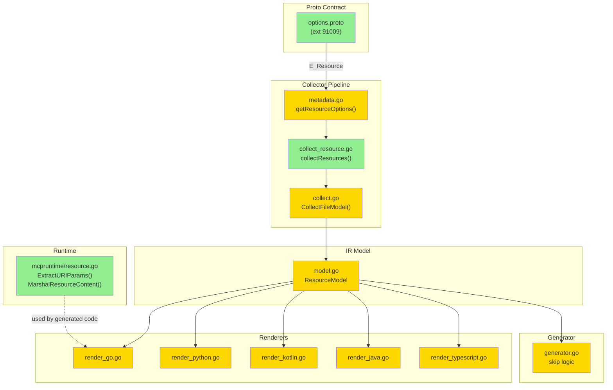

# MCP Resources — Design

**Status:** Draft
**Author:** AI Agent
**Date:** 2026-06-12

## Обзор

Проектируемая фича добавляет MCP Resources — третий серверный примитив (после Tools и Prompts) — в генератор `protoc-gen-mcp`. Реализация делится на 5 логических частей:

1. **Proto contract** — `ResourceOptions`, `ResourceAnnotations`, `ResourceAudience`, extension 91009
2. **IR Model + Collector** — `ResourceModel` в `FileModel`, `collectResources()` в `collect_resource.go`
3. **Runtime helpers** — `mcpruntime/resource.go`: `ExtractURIParams()`, `MarshalResourceContent()`
4. **Renderers** — Go, Python, Kotlin, Java, TypeScript: `<File>ResourceHandler` + `Register<File>Resources()`
5. **Tests** — collector unit tests, runtime unit tests, golden tests для 5 языков

## Архитектура



**Порядок реализации:**
1. Proto contract (options.proto) — базовый dependency
2. IR Model (model.go) — типы для остальных компонентов
3. Metadata (metadata.go) — извлечение опций
4. Collector (collect_resource.go, collect.go) — заполнение IR
5. Runtime (mcpruntime/resource.go) — хэлперы для генерированного кода
6. Go Renderer (render_go.go) — первый рендерер, валидация шаблона
7. Generator dispatch (generator.go) — skip logic
8. Остальные рендереры (Python, Kotlin, Java, TypeScript) — параллельно
9. Golden tests и fixtures

## Компоненты и интерфейсы

### Файлы, требующие изменений

| File | Change Type | Description |
|------|-------------|-------------|
| `mcp/options/v1/options.proto` | `[MODIFIED]` | Добавляет `ResourceOptions`, `ResourceAnnotations`, `ResourceAudience` enum, extension `resource = 91009` |
| `internal/codegen/model.go` | `[MODIFIED]` | Добавляет `ResourceModel`, `ResourceParamModel`, поле `Resources []ResourceModel` в `FileModel` |
| `internal/codegen/metadata.go` | `[MODIFIED]` | Добавляет `getResourceOptions()` по паттерну `getPromptOptions()` |
| `internal/codegen/collect_resource.go` | `[NEW]` | Collector для ресурсов: сканирование messages, валидация uri XOR uri_template, парсинг `{param}` |
| `internal/codegen/collect_resource_test.go` | `[NEW]` | Unit-тесты collector по паттерну `collect_prompt_test.go` |
| `internal/codegen/collect.go` | `[MODIFIED]` | Вызов `collectResources(file)` после `collectPrompts(file)`, результат в `model.Resources` |
| `internal/codegen/generator.go` | `[MODIFIED]` | Skip logic: добавление `len(model.Resources) > 0` во все проверки пустых файлов |
| `internal/codegen/render_go.go` | `[MODIFIED]` | Генерация `<File>ResourceHandler` interface и `Register<File>Resources()` для ресурсов |
| `internal/codegen/render_python.go` | `[MODIFIED]` | Генерация Python Protocol class и `register_<file>_resources()` для ресурсов |
| `internal/codegen/render_kotlin.go` | `[MODIFIED]` | Генерация Kotlin interface и `register<File>Resources()` для ресурсов |
| `internal/codegen/render_java.go` | `[MODIFIED]` | Генерация Java nested interface и `register<File>Resources()` для ресурсов |
| `internal/codegen/render_typescript.go` | `[MODIFIED]` | Генерация TypeScript interface и `register<File>Resources()` для ресурсов |
| `mcpruntime/resource.go` | `[NEW]` | Runtime хэлперы: `ExtractURIParams()`, `MarshalResourceContent()` |
| `mcpruntime/resource_test.go` | `[NEW]` | Unit-тесты runtime хэлперов |
| `testdata/golden/example_mcp.go.golden` | `[MODIFIED]` | Добавление golden output для ресурсов (если test fixtures содержат ресурсы) |
| `testdata/golden/example_mcp.py.golden` | `[MODIFIED]` | Python golden output |
| `testdata/golden/example_mcp.kt.golden` | `[MODIFIED]` | Kotlin golden output |
| `testdata/golden/example_mcp.java.golden` | `[MODIFIED]` | Java golden output |
| `testdata/golden/example_mcp.ts.golden` | `[MODIFIED]` | TypeScript golden output |

### Файлы, НЕ требующие изменений

| File | Reason Unchanged |
|------|-----------------|
| `mcpruntime/register.go` | Содержит `RegisterProtoTool` для Tools. Resources используют прямые SDK calls (`AddResource`/`AddResourceTemplate`), не нуждаются в generic tool registration |
| `mcpruntime/prompt.go` | Содержит `ParsePromptArguments` для Prompts. Resources не парсят аргументы через proto reflection — URI params извлекаются строковым парсингом |
| `mcpruntime/options.go` | `RegisterOption` и `WithNamespace` переиспользуются as-is — Resources будут принимать те же `RegisterOption` |
| `internal/codegen/collect_prompt.go` | Prompt collector не меняется, Resource collector — отдельный файл |
| `internal/codegen/options.go` | Plugin option parsing (`lang=`, `python_handler=`) не расширяется — Resources не требуют новых plugin params |
| `internal/codegen/request.go` | Go package synthesis для non-Go languages не затрагивается |
| `internal/schema/` | JSON Schema generation не задействован — Resources не имеют input schema |
| `cmd/protoc-gen-mcp/` | Entrypoint не меняется |
| `cmd/example-mcp-server/` | Обновление examples — deferred, не в scope Phase 3 |

### Интерфейсы

#### Proto contract

```protobuf
// [NEW] mcp/options/v1/options.proto

enum ResourceAudience {
  RESOURCE_AUDIENCE_UNSPECIFIED = 0;
  RESOURCE_AUDIENCE_USER = 1;
  RESOURCE_AUDIENCE_ASSISTANT = 2;
}

message ResourceAnnotations {
  repeated ResourceAudience audience = 1;
  optional double priority = 2;
}

message ResourceOptions {
  string uri = 1;            // Static resource URI (mutually exclusive with uri_template)
  string uri_template = 2;   // URI template with {param} placeholders (RFC 6570 simple string)
  string name = 3;           // Display name (defaults to proto message name)
  string description = 4;    // Human-readable description
  string mime_type = 5;      // MIME type (defaults to "application/json")
  ResourceAnnotations annotations = 6;
  repeated Icon icons = 7;
}

extend google.protobuf.MessageOptions {
  ResourceOptions resource = 91009;
}
```

#### IR Model

```go
// [NEW] internal/codegen/model.go additions

// ResourceModel represents a single MCP resource derived from a proto message.
type ResourceModel struct {
    ProtoFullName string
    ProtoName     string
    Name          string
    Description   string
    URI           string              // Non-empty for static resources
    URITemplate   string              // Non-empty for template resources
    MIMEType      string              // Defaults to "application/json"
    IsTemplate    bool                // true when URITemplate is set
    Params        []ResourceParamModel // Extracted from URITemplate {param}
    Annotations   *mcpoptionsv1.ResourceAnnotations
    Icons         []*mcpoptionsv1.Icon
    Output        TypeRef             // Reference to proto message (output schema)
}

// ResourceParamModel represents one parameter from a URI template.
type ResourceParamModel struct {
    Name string // Parameter name from {param} placeholder
}
```

#### Collector

```go
// [NEW] internal/codegen/collect_resource.go

// collectResources scans all messages for (mcp.options.v1.resource).
// Returns fail-fast error on: both uri+uri_template, neither set,
// template without params, invalid param identifiers.
func collectResources(file *protogen.File) ([]ResourceModel, error)
```

#### Metadata

```go
// [NEW addition to] internal/codegen/metadata.go

func getResourceOptions(message *protogen.Message) (*mcpoptionsv1.ResourceOptions, error)
```

#### Runtime helpers

```go
// [NEW] mcpruntime/resource.go

// ExtractURIParams extracts parameter values from a resolved URI
// by matching it against the URI template pattern.
// Returns map[paramName]value.
// Error if URI doesn't match template or required param is missing.
func ExtractURIParams(uri string, uriTemplate string) (map[string]string, error)

// MarshalResourceContent serializes a proto message to ProtoJSON
// and wraps it in mcp.TextResourceContents with the given URI and MIME type.
func MarshalResourceContent(uri string, mimeType string, msg proto.Message) ([]mcp.ResourceContents, error)
```

#### Go generated interface (example)

```go
// Generated from example.proto containing resource messages

type ExampleResourceHandler interface {
    // Static resource — no params
    ReadAppConfig(ctx context.Context) (*AppConfig, error)

    // Template resource — List + Read with extracted params
    ListUserProfiles(ctx context.Context) ([]mcp.Resource, error)
    ReadUserProfile(ctx context.Context, userID string) (*UserProfile, error)
}

func RegisterExampleResources(
    ctx context.Context,
    server *mcp.Server,
    impl ExampleResourceHandler,
    opts ...mcpruntime.RegisterOption,
) error
```

**Postconditions для `RegisterExampleResources`:**
- Каждый статический ресурс зарегистрирован через `server.AddResource()`
- Каждый шаблонный ресурс: `impl.List*()` вызван, экземпляры зарегистрированы через `server.AddResource()`, шаблон зарегистрирован через `server.AddResourceTemplate()`
- При ошибке из `List*()` или SDK — функция возвращает error

## Ключевые решения (ADR)

### Decision 1: `context.Context` в `Register*Resources()`

- **Context:** `List*()` вызывается при регистрации. Handler может обращаться к БД/сети для перечисления экземпляров. Нужен ли `context.Context`?
- **Options:**
  1. Без context — `RegisterExampleResources(server, impl, opts...)` (как промпты)
  2. С context — `RegisterExampleResources(ctx, server, impl, opts...)` (отличается от промптов)
- **Decision:** Вариант 2 — с `context.Context`.
- **Rationale:** `List*()` может обращаться к внешним системам (БД, API). Без context нельзя передать timeout/cancellation. Промпты не вызывают user code при регистрации, поэтому им context не нужен. Resources — другой случай.
- **Consequences:** Сигнатура `Register*Resources` отличается от `Register*Prompts` (добавляется ctx). Это оправдано семантической разницей — Resources выполняют user code при регистрации.

### Decision 2: Переиспользование `RegisterOption` vs отдельный `ResourceOption`

- **Context:** Нужно ли создавать отдельный тип `ResourceOption` или переиспользовать существующий `RegisterOption` из `mcpruntime/options.go`?
- **Options:**
  1. Новый `ResourceOption` — типобезопасность, но дублирование
  2. Переиспользование `RegisterOption` — единообразие, меньше кода
- **Decision:** Вариант 2 — переиспользование `RegisterOption`.
- **Rationale:** Единственная общая опция — `WithNamespace`. Для Tools, Prompts и Resources namespace работает одинаково (prefix к display name). Дублирование не оправдано.
- **Consequences:** Если в будущем Resources потребуют специфичных опций (например, `WithSubscription`), придётся мигрировать на отдельный тип. Для MVP это маловероятно.

### Decision 3: Обработка ошибки из `Register*Resources`

- **Context:** `Register*Resources` вызывает `impl.List*()`, `server.AddResource()`, `server.AddResourceTemplate()`. Каждый может вернуть ошибку.
- **Options:**
  1. Return error на первой ошибке (fail-fast)
  2. Collect все ошибки, вернуть объединённую (best-effort)
  3. Panic (как `MustRegister` pattern)
- **Decision:** Вариант 1 — fail-fast, `func Register*Resources(...) error`.
- **Rationale:** Согласуется с `RegisterProtoTool` (тоже возвращает error). Ошибка при регистрации — фатальна, сервер не должен стартовать с неполной конфигурацией. Fail-fast упрощает отладку.
- **Consequences:** Если один ресурс не может быть зарегистрирован, остальные тоже не будут. Пользователь должен исправить ошибку до старта.

### Decision 4: Namespace и URI

- **Context:** Namespace для Tools применяется как prefix к tool name. Для Resources namespace может применяться к `name` (display name в `resources/list`) и/или к `uri`/`uri_template`.
- **Options:**
  1. Namespace → только `name`
  2. Namespace → `name` + `uri`/`uri_template`
- **Decision:** Вариант 1 — namespace → только `name`.
- **Rationale:** URI — стабильный адрес ресурса, не должен зависеть от параметров регистрации. Клиенты кэшируют URI. Изменение URI при смене namespace ломает кэши. Display name — presentation concern, безопасно изменять.
- **Consequences:** Два сервера с разными namespace могут зарегистрировать ресурсы с одинаковыми URI — это конфликт на уровне SDK, который обнаружится при `AddResource()`.

### Decision 5: Backward Compatibility (Versioning)

- **Context:** Добавление extension 91009 в `options.proto` — изменение public API.
- **Decision:** Аддитивное расширение, backward compatible.
- **Rationale:** Extension numbers > 91008 ранее не использовались. Старый `protoc-gen-mcp` игнорирует неизвестные extensions. Новый `protoc-gen-mcp` обрабатывает как старые, так и новые. Proto files без `(mcp.options.v1.resource)` — без изменений.
- **Migration path:** Нет миграции. Пользователи добавляют `(mcp.options.v1.resource)` к messages по желанию.

## Модели данных

```go
// [NEW] ResourceModel — IR для ресурса
ResourceModel {
    ProtoFullName string                          // "example.v1.AppConfig"
    ProtoName     string                          // "AppConfig"
    Name          string                          // "app_config" (display name)
    Description   string                          // From option or comment
    URI           string                          // "config://app" (static only)
    URITemplate   string                          // "users://{user_id}/profile" (template only)
    MIMEType      string                          // "application/json" (default)
    IsTemplate    bool                            // true when URITemplate != ""
    Params        []ResourceParamModel            // [{Name: "user_id"}] (template only)
    Annotations   *mcpoptionsv1.ResourceAnnotations // {audience, priority}
    Icons         []*mcpoptionsv1.Icon            // []
    Output        TypeRef                         // {ProtoFullName: "example.v1.AppConfig", ...}
}

// [NEW] ResourceParamModel — URI template parameter
ResourceParamModel {
    Name string  // "user_id" from "{user_id}"
}

// [NEW] ResourceAnnotations — proto message в options.proto
ResourceAnnotations {
    audience []ResourceAudience  // [USER, ASSISTANT]
    priority *double             // 0.5 (optional)
}

// [NEW] ResourceAudience — proto enum в options.proto
ResourceAudience {
    RESOURCE_AUDIENCE_UNSPECIFIED = 0
    RESOURCE_AUDIENCE_USER = 1
    RESOURCE_AUDIENCE_ASSISTANT = 2
}

// [NEW] ResourceOptions — proto message в options.proto
ResourceOptions {
    uri          string              // "config://app"
    uri_template string              // "users://{user_id}/profile"
    name         string              // "app_config"
    description  string              // "Application configuration"
    mime_type    string              // "application/json"
    annotations  ResourceAnnotations // {audience: [USER], priority: 0.8}
    icons        []Icon              // reuse existing Icon message
}
```

## Correctness Properties

**Property 1: URI XOR URI Template Exclusion**
Category: Exclusion
Statement: For all proto messages with `(mcp.options.v1.resource)`, `uri` и `uri_template` никогда не заданы одновременно — генератор отклоняет такие конфигурации с ошибкой.
Validates: Requirements 1.5

**Property 2: Required URI or URI Template**
Category: Absence
Statement: For all proto messages with `(mcp.options.v1.resource)`, отсутствие и `uri`, и `uri_template` никогда не допускается — генератор отклоняет с ошибкой.
Validates: Requirements 1.6

**Property 3: Template Parameter Extraction Equivalence**
Category: Equivalence
Statement: For all URI templates вида `scheme://{p1}/path/{p2}` и resolved URI `scheme://val1/path/val2`, `ExtractURIParams` возвращает `{p1: val1, p2: val2}` — extracted values точно соответствуют позиционным значениям в URI.
Validates: Requirements 9.1

**Property 4: Missing Parameter Absence**
Category: Absence
Statement: For all resolved URI, которые не содержат значения для всех параметров шаблона, `ExtractURIParams` никогда не возвращает неполный результат — всегда error.
Validates: Requirements 9.2

**Property 5: ProtoJSON Round-trip**
Category: Round-trip
Statement: For all proto messages, `MarshalResourceContent(uri, mimeType, msg)` создаёт `TextResourceContents`, содержимое которых при unmarshal обратно через ProtoJSON даёт эквивалентный proto message.
Validates: Requirements 9.3

**Property 6: Resource Model Propagation**
Category: Propagation
Statement: For all proto files, каждый message с `(mcp.options.v1.resource)` отображается ровно в один `ResourceModel` в `FileModel.Resources`, с корректным `IsTemplate`, `Params`, `URI`/`URITemplate`.
Validates: Requirements 2.1, 2.2, 2.3

**Property 7: Template Without Params Absence**
Category: Absence
Statement: For all `uri_template` без `{param}` placeholder-ов, генератор никогда не создаёт ResourceModel — отклоняет с ошибкой, рекомендуя `uri`.
Validates: Requirements 3.2

**Property 8: Default Name Equivalence**
Category: Equivalence
Statement: For all messages без явного `name` в `ResourceOptions`, display name ресурса эквивалентен `toSnakeCase(messageName)`.
Validates: Requirements 3.3

**Property 9: Namespace Propagation**
Category: Propagation
Statement: For all вызовов `Register*Resources` с namespace, namespace применяется как prefix к display `name`, но `uri` и `uri_template` остаются без изменений.
Validates: Requirements 4.8

**Property 10: Non-empty File Propagation**
Category: Propagation
Statement: For all proto files, содержащих только Resource messages (без Services и Prompts), генератор создаёт выходной файл (не пропускает).
Validates: Requirements 2.4

**Property 11: List Handler Propagation**
Category: Propagation
Statement: For all шаблонных ресурсов, генерированный `Register*Resources` вызывает `List*()` и регистрирует каждый возвращённый экземпляр через `server.AddResource()`, а также регистрирует шаблон через `server.AddResourceTemplate()`.
Validates: Requirements 4.4, 4.7

**Property 12: Annotations Propagation**
Category: Propagation
Statement: For all ресурсов с заданными `ResourceAnnotations`, `audience` и `priority` пробрасываются в `mcp.Resource.Annotations` / `mcp.ResourceTemplate.Annotations`.
Validates: Requirements 4.9

**Property 13: Golden Output Equivalence**
Category: Equivalence
Statement: For all 5 языков (Go, Python, Kotlin, Java, TypeScript), генерированный вывод для тестовых фикстур с ресурсами побайтово совпадает с golden файлами.
Validates: Requirements 10.1, 10.2

## Error Handling

| Scenario | Detection | Action |
|----------|-----------|--------|
| Оба `uri` и `uri_template` заданы | `collectResources`: оба поля non-empty | Fail-fast error: `"resource %s: uri and uri_template are mutually exclusive"` |
| Ни `uri`, ни `uri_template` | `collectResources`: оба поля empty | Fail-fast error: `"resource %s: either uri or uri_template must be set"` |
| `uri_template` без `{param}` | `collectResources`: regex не нашёл `{...}` | Fail-fast error: `"resource %s: uri_template %q has no parameters, use uri instead"` |
| Невалидный identifier в `{...}` | `collectResources`: regex `{[a-zA-Z_][a-zA-Z0-9_]*}` не совпадает | Fail-fast error: `"resource %s: invalid parameter %q in uri_template"` |
| `impl` is nil в `Register*Resources` | Nil check в generated `Register*` | Return error: `"Register*Resources: impl is nil"` |
| `List*()` возвращает error | Generated code checks return | Return wrapped error: `"Register*Resources: listing %s: %w"` |
| `server.AddResource()` fails | SDK returns error | Return wrapped error: `"Register*Resources: adding resource %s: %w"` |
| `server.AddResourceTemplate()` fails | SDK returns error | Return wrapped error: `"Register*Resources: adding template %s: %w"` |
| `MarshalResourceContent` fails (proto marshal error) | `protojson.Marshal` returns error | Return wrapped error passed to caller |
| `ExtractURIParams`: URI не соответствует template | Pattern match fails | Return error: `"uri %q does not match template %q"` |
| `ExtractURIParams`: пустое значение параметра | Extracted segment is empty | Return error: `"parameter %q has empty value in uri %q"` |

## Testing Strategy

**Test Style Source:** Tier 2
- Evidence: `internal/codegen/collect_prompt_test.go`, `mcpruntime/prompt_test.go`, `mcpruntime/register_test.go`
- Key patterns: `newTempProtogenPlugin(t, protoFiles, generateFile)` для collector tests; direct `t.Fatalf` assertions; inline proto source в test constants
- PBT unavailable — using targeted unit tests as substitute

**Project Commands:**

| Action   | Command                           |
|----------|-----------------------------------|
| Test     | `go test ./... -count=1`          |
| Build    | `go build ./cmd/protoc-gen-mcp`   |
| Lint     | `easyp lint`                      |
| Generate | `easyp generate`                  |

### Unit Tests

| Test | Description | Tags |
|------|-------------|------|
| `TestCollectResources_RecognizesStaticResource` | Message с `uri` распознаётся как статический ресурс, IsTemplate=false | `Feature/collect-resource` |
| `TestCollectResources_RecognizesTemplateResource` | Message с `uri_template` распознаётся как шаблонный, params извлечены | `Feature/collect-resource` |
| `TestCollectResources_SkipsNonResourceMessage` | Message без option игнорируется | `Feature/collect-resource` |
| `TestCollectResources_DefaultNameSnakeCase` | Пустой `name` → `toSnakeCase(MessageName)` | `Feature/collect-resource` |
| `TestCollectResources_DefaultMIMEType` | Пустой `mime_type` → `"application/json"` | `Feature/collect-resource` |
| `TestCollectResources_DescriptionFromComment` | Пустой `description` → из proto leading comment | `Feature/collect-resource` |
| `TestCollectResources_RejectsBothURIAndTemplate` | Fail-fast при обоих uri и uri_template | `Feature/collect-resource-validation` |
| `TestCollectResources_RejectsNeitherURINorTemplate` | Fail-fast при отсутствии обоих | `Feature/collect-resource-validation` |
| `TestCollectResources_RejectsTemplateWithoutParams` | Fail-fast при uri_template без `{...}` | `Feature/collect-resource-validation` |
| `TestCollectResources_RejectsInvalidParamIdentifier` | Fail-fast при `{123bad}` | `Feature/collect-resource-validation` |
| `TestCollectResources_MultipleParamsExtracted` | `{a}/path/{b}` → 2 params | `Feature/collect-resource` |
| `TestCollectResources_AnnotationsPropagated` | `ResourceAnnotations` передаются в модель | `Feature/collect-resource` |
| `TestExtractURIParams_SimpleTemplate` | `users://{id}` + `users://alice` → `{id: alice}` | `Feature/runtime-resource` |
| `TestExtractURIParams_MultipleParams` | `{a}/path/{b}` → оба значения | `Feature/runtime-resource` |
| `TestExtractURIParams_MismatchedURI` | URI не соответствует template → error | `Feature/runtime-resource` |
| `TestExtractURIParams_EmptyParam` | Пустое значение → error | `Feature/runtime-resource` |
| `TestMarshalResourceContent_ProtoJSON` | Proto message → TextResourceContents с JSON | `Feature/runtime-resource` |
| `TestMarshalResourceContent_CustomMIMEType` | MIME type пробрасывается в результат | `Feature/runtime-resource` |
| `TestGeneratorSkipLogic_ResourceOnlyFile` | Файл с только ресурсами → не пропускается | `Feature/generator-resources` |

### Property-Based Tests (targeted unit test substitutes)

| Test | Property | Generator description | Tags |
|------|----------|-----------------------|------|
| `prop_URIXORTemplate` | CP-1 | Пары (uri, uri_template) с обоими non-empty | `Property/1` |
| `prop_RequiredURIOrTemplate` | CP-2 | Пары (uri, uri_template) с обоими empty | `Property/2` |
| `prop_ExtractParamsEquivalence` | CP-3 | Генерация URI template + resolved URI из random params | `Property/3` |
| `prop_MissingParamAbsence` | CP-4 | URI template с N params, resolved URI с N-1 segments | `Property/4` |
| `prop_ProtoJSONRoundTrip` | CP-5 | Random proto message → marshal → unmarshal → compare | `Property/5` |
| `prop_ResourceModelPropagation` | CP-6 | Proto files с 0..N resource messages → verify |model.Resources| | `Property/6` |
| `prop_TemplateWithoutParams` | CP-7 | uri_template строки без `{...}` | `Property/7` |
| `prop_DefaultNameEquivalence` | CP-8 | Message names → toSnakeCase → verify ResourceModel.Name | `Property/8` |
| `prop_NamespacePropagation` | CP-9 | Random namespaces → verify name prefixed, uri unchanged | `Property/9` |
| `prop_NonEmptyFile` | CP-10 | Proto files с only resources → verify generation not skipped | `Property/10` |
| `prop_ListHandlerPropagation` | CP-11 | Template resources → verify List called + instances registered | `Property/11` |
| `prop_AnnotationsPropagation` | CP-12 | ResourceAnnotations with audience/priority → verify in output | `Property/12` |
| `prop_GoldenOutputEquivalence` | CP-13 | Golden file comparison for all 5 languages | `Property/13` |
